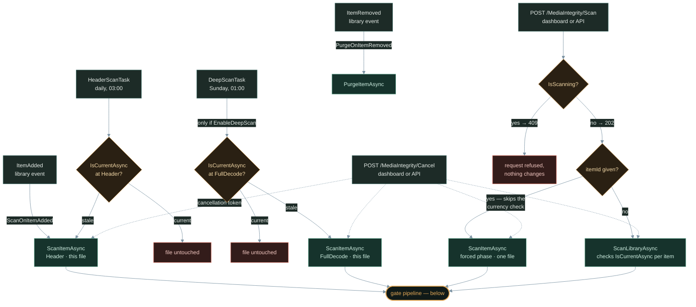
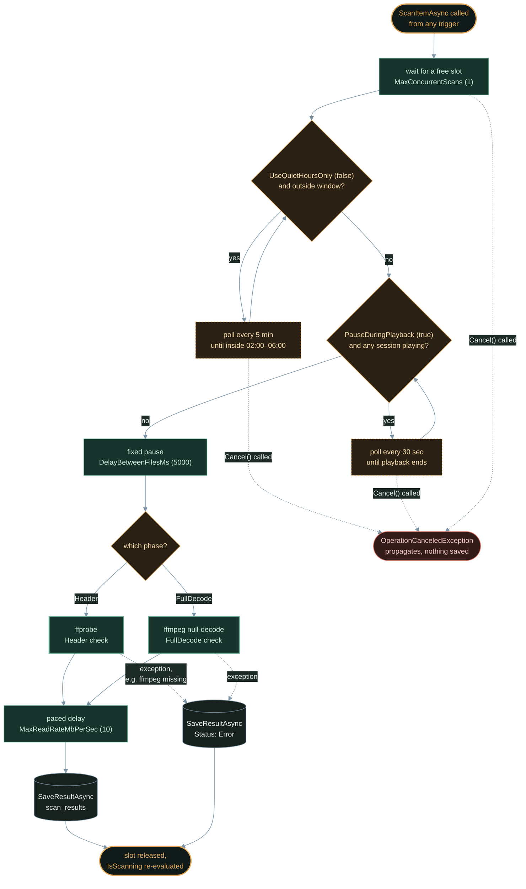
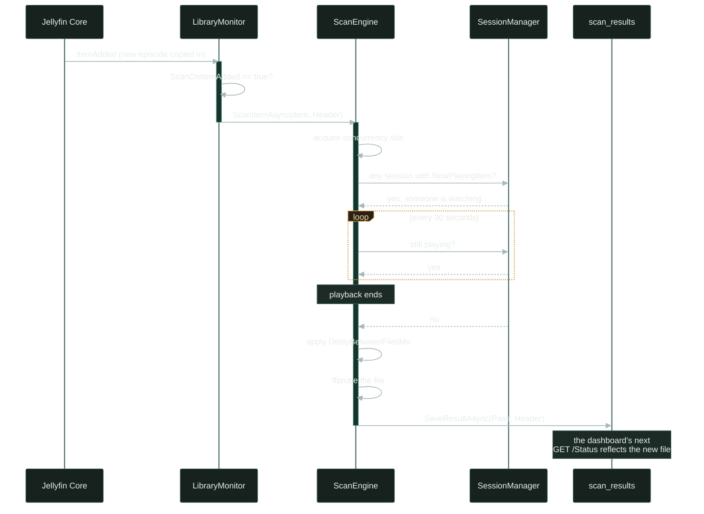
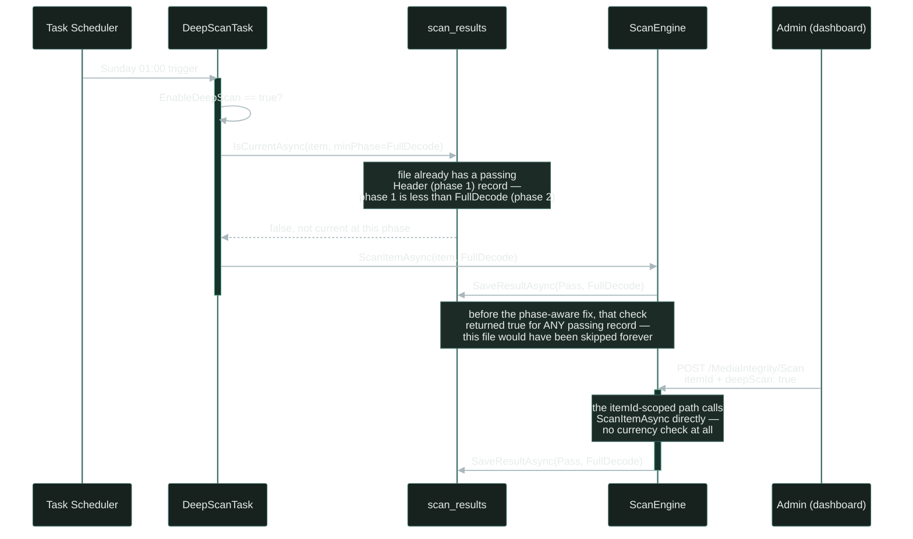

# Architecture: Event Flow and Scan Pipeline

This document maps every path that can start, gate, or stop a scan, and works
through two concrete scenarios where those paths interact. It's meant to
answer "what does the plugin actually do when X happens" without reading the
whole codebase.

Six triggers reach into the same `ScanEngine`: two are Jellyfin's own library
events, two are the plugin's scheduled tasks, and two come from the dashboard
or settings page hitting the REST API directly. Everything converges on the
same per-file gate pipeline — nothing gets special treatment once it's queued.

## Where a Scan Begins

The one asymmetry worth remembering: an `itemId`-scoped API scan skips the
currency check entirely — it always runs. That's the only way to force a
re-scan of a file the scheduled tasks would otherwise consider "already
handled." See the second scenario below.

## Inside One File's Scan

However a file got here, `ScanItemAsync` runs the same five gates in the same
order before ffmpeg ever touches the file. Each gate is independently
configurable via `PluginConfiguration`, and three of them are polling loops
the scan can sit inside for a while before proceeding.

## Scenario: New Arrival Mid-Stream

A new episode finishes copying into a watched folder while someone's already
three episodes deep into the same show. `ScanOnItemAdded` fires the moment
Jellyfin notices the file — the scan doesn't wait for Jellyfin's own library
scan to finish, but it does wait for the living room to stop.

## Scenario: The Sunday Deep Scan

Every file in the library gets a quick Header check on arrival, but a full
byte-stream decode only happens if `EnableDeepScan` is on — and only for
files the scheduled task doesn't think it already has covered. This is the
exact logic that shipped broken for a while: the "already covered" check
didn't distinguish a Header pass from a FullDecode pass, so a deep scan could
silently never run against a file that had merely passed its arrival check
(fixed in [PR #17](https://github.com/mcgarrah/jellyfin-plugin-media-integrity-scanner/pull/17)).

Why this matters: if `EnableDeepScan` doesn't seem to touch files that
already loaded in cleanly, this was why. Fixed now — the currency check
compares scan phase, not just pass/fail.

## Settings Reference

Every gate and trigger above is backed by a real `PluginConfiguration` field,
editable from **Dashboard → Plugins → Media Integrity Scanner → Settings**.

| Setting | Default | What it actually does |
|---|---|---|
| `MaxConcurrentScans` | `1` | Size of the semaphore every file scan waits on — the hard ceiling on simultaneous ffmpeg processes, for both manual and scheduled scans. |
| `DelayBetweenFilesMs` | `5000` | Fixed pause immediately before each file's ffprobe/ffmpeg call, after all other gates have cleared. |
| `PauseDuringPlayback` | `true` | Checks every active Jellyfin session for a `NowPlayingItem`; if any exist, the scan polls every 30 seconds until they don't. |
| `UseQuietHoursOnly` | `false` | Restricts scanning to the window below; outside it, the scan polls every 5 minutes. |
| `QuietHoursStart` / `QuietHoursEnd` | `02:00` / `06:00` | The window checked above, can span midnight. |
| `MaxReadRateMbPerSec` | `10` | Applied *after* each file completes — a delay sized to the file's bytes and how long the scan actually took, to keep sustained I/O bounded. |
| `EnableDeepScan` | `false` | Master switch for the whole weekly FullDecode task — off means `DeepScanTask` reports 100% progress and exits immediately. |
| `ScanOnItemAdded` | `true` | Whether `LibraryMonitor` reacts to Jellyfin's `ItemAdded` event with an automatic Header scan. |
| `PurgeOnItemRemoved` | `true` | Whether `ItemRemoved` deletes that item's scan history rather than leaving it orphaned. |
| `FfmpegPathOverride` / `FfprobePathOverride` | *(auto-detected)* | Skips `FfmpegResolver`'s autodetection in favor of an explicit binary path. |

## Source Reference

- `Api/MediaIntegrityController.cs` — REST endpoints (`Status`, `Results`, `Results/{itemId}`, `Scan`, `Cancel`)
- `Scanner/ScanEngine.cs` — the gate pipeline and `ScanLibraryAsync`/`ScanItemAsync`
- `EventHandlers/LibraryMonitor.cs` — `ItemAdded`/`ItemRemoved` handling
- `ScheduledTasks/HeaderScanTask.cs`, `ScheduledTasks/DeepScanTask.cs` — the two scheduled sweeps
- `Data/SqliteDatabaseManager.cs` — `IsCurrentAsync` and the `scan_results` schema
